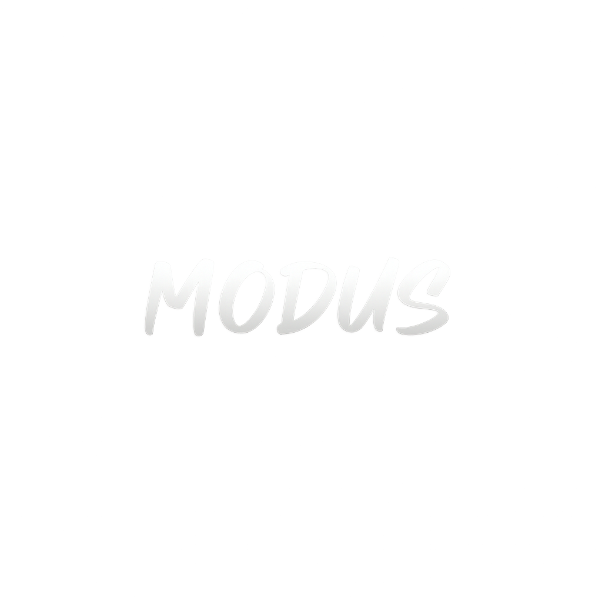
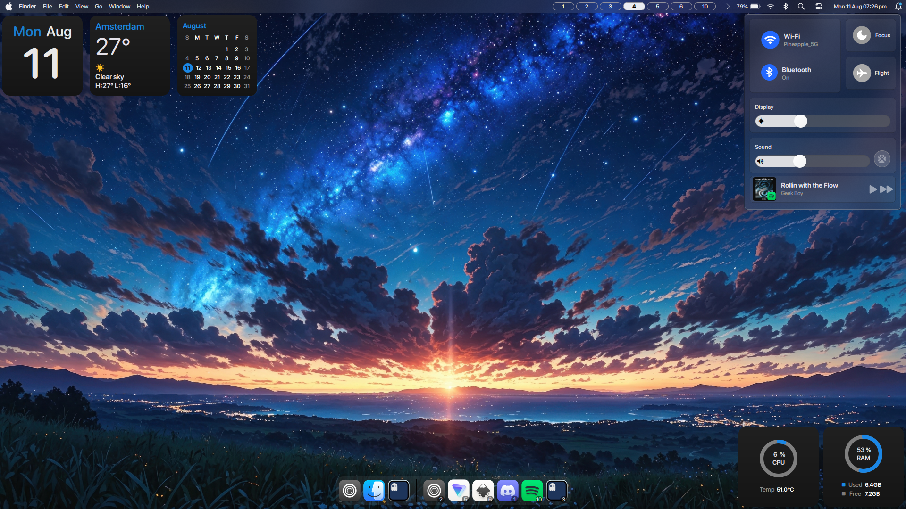
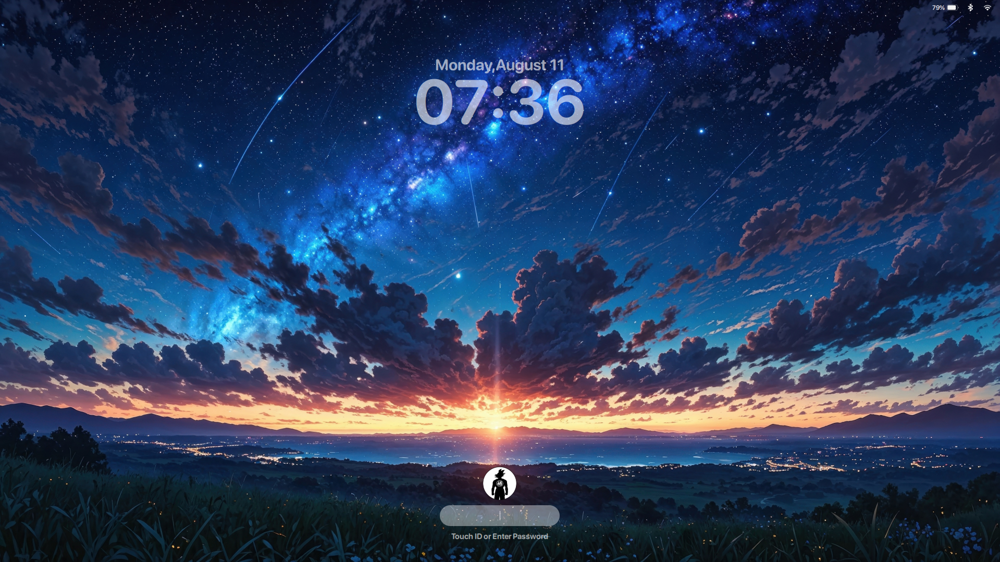

<p align="center">
  
</p>

<p align="center">
  <sub><sup></sup></sub>
  <a href="https://github.com/hyprwm/Hyprland">
    
  </a>
  <a href="https://github.com/Fabric-Development/fabric/">
    
  <sub><sup></sup></sub>
  </a>
  </p>

<div align="center">

[](https://github.com/S4NKALP/Modus/stargazers)
[](https://hyprland.org/)
[]()
[](https://discord.gg/tRFxkbQ3Zq)

</div>

<br>

<figure>
  <h2>Home Screen:</h2>
  
  <br/>
  <h2>Lock Screen:</h2>
    
</figure>
<br>

## Quick Start

```bash
curl -fsSL https://raw.githubusercontent.com/S4NKALP/Modus/macos/install.sh -o install.sh && bash install.sh
```

The interactive installer handles dependencies, builds C-extensions, and configures Hyprland.

## Manual Installation

<details>
<summary>Click to expand manual install steps</summary>

1. **Install dependencies:**

   ```bash
   paru -S uv fabric-cli-git uwsm cliphist slurp grim swappy wl-clipboard wtype libnotify playerctl matugen-bin hypridle hyprsunset hyprpicker hyprshot gtk-session-lock awww otf-apple-sf-pro webp-pixbuf-loader cinnamon-desktop libmediaart acpi brightnessctl power-profiles-daemon at-spi2-core networkmanager network-manager-applet blueman pipewire libpulse gcc make pkgconf meson ninja wayland-protocols gobject-introspection gtk-layer-shell librsvg libqalculate appmenu-gtk-module libdbusmenu-gtk3 libdbusmenu-qt5 pciutils wf-recorder ffmpeg --needed
   ```

2. **Clone and sync:**

   ```bash
   git clone https://github.com/S4NKALP/Modus ~/.config/Modus
   cd ~/.config/Modus
   uv sync
   ```

3. **Build App Switcher backend:**

   ```bash
   cd src/window/switcher/app-capture
   meson setup builddir
   meson compile -C builddir
   ```

4. **Build Global Menu shim:**

   ```bash
   cd src/window/globalmenu
   gcc -shared -fPIC -O2 -o libmenu_button_shim.so libmenu_button_shim.c $(pkg-config --cflags --libs gtk+-3.0) -ldl
   ```

5. **Start Modus:**

   ```bash
   cd ~/.config/Modus
   uv run start
   ```

</details>

## Post Installation

- Install recommended [Icon theme](https://github.com/vinceliuice/MacTahoe-icon-theme), [GTK theme](https://github.com/vinceliuice/MacTahoe-gtk-theme), and [Cursor theme](https://github.com/vinceliuice/MacTahoe-icon-theme/tree/main/cursors)
- Source `config/hypr/modus.lua` in your Hyprland config
- Lock screen bind: set to `uv run lock`

## Keybinds

| Key                 | Action                 |
| ------------------- | ---------------------- |
| `Super + D`         | Spotlight search       |
| `Super + E`         | Emoji picker           |
| `Super + V`         | Clipboard history      |
| `Super + W`         | Wallpaper browser      |
| `Super + I`         | Settings               |
| `Super + L`         | Lock screen            |
| `Super + Z`         | Screencapture toggle   |
| `Super + S`         | Screenshot region      |
| `Alt + Tab`         | Window switcher        |
| `Alt + Space`       | Keyboard layout switch |
| `Super + Shift + R` | Reload Modus           |
| `Super + Shift + Y` | Reload CSS             |
| `Alt + Shift + W`   | Random wallpaper       |

## Configuration

Three TOML files in `config/`:

| File          | Purpose                                  | Reload  |
| ------------- | ---------------------------------------- | ------- |
| `config.toml` | Main settings (features, widgets, paths) | Restart |
| `mods.toml`   | Custom panel buttons                     | Instant |
| `dock.toml`   | Pinned dock apps                         | Restart |

You can also toggle most settings from the **Settings window** (`Super + I`).

See [Configuration Guide](docs/configuration.md) for full reference.

## Documentation

| Doc                                           | What's inside                                      |
| --------------------------------------------- | -------------------------------------------------- |
| [Installation Guide](docs/installation.md)    | Automated & manual install, dependencies           |
| [Configuration Guide](docs/configuration.md)  | `config.toml`, `mods.toml`, `dock.toml`, keybinds  |
| [Styling Guide](docs/styling.md)              | Matugen colors, CSS customization                  |
| [Architecture Overview](docs/architecture.md) | App Switcher C-backend, Spotlight engine, Services |
| [Spotlight Plugins](docs/plugins.md)          | Install/customize plugins, write your own          |
| [FAQs & Tips](docs/faqs_tips.md)              | Troubleshooting, shortcuts, live reload            |

## Custom Mods

Define panel buttons in `config/mods.toml`:

```toml
[Mods.terminal]
icon = "terminal.svg"
icon-size = 16
order = 1
on-clicked = "kitty"
```

- `icon` — SVG filename in `src/assets/icons/`
- `icon-size` — defaults to 16
- `order` — button position (lower = first)
- `on-clicked` — shell command on click
- `on-left`, `on-middle`, `on-right` — per-mouse-button commands
- `options` — dropdown menu entries (each with `label` + `on-clicked`)
- Live reload — edits apply instantly

## Spotlight Plugins

Drop a `.py` file in `config/plugins/` and it works instantly:

```bash
cp examples/plugins/hello.py config/plugins/hello.py
# Hit Super+D, type "hi" — greeting appears
```

Plugin development with hot reload:

```bash
nvim config/plugins/hello.py
fabric-cli exec modus 'deep_reload hello'   # no restart needed
```

See [Spotlight Plugins](docs/plugins.md) for full docs and examples.

## Global Menu Compatibility

Modus injects `libmenu_button_shim.so` only into GTK3 apps launched through Modus (dock, spotlight, panel). GTK4 apps are never touched.

For terminal-launched GTK3 apps, use a wrapper:

```bash
#!/usr/bin/env bash
SHIM=~/.config/Modus/src/window/globalmenu/libmenu_button_shim.so
BIN="$(command -v "$1")"
if [[ -n "$BIN" ]] && readelf -d "$BIN" 2>/dev/null | grep -q 'libgtk-3\.so\.0'; then
    LD_PRELOAD="$SHIM" "$@"
else
    "$@"
fi
```

Save as `~/.local/bin/modus-launch`, make executable, run GTK3 apps as `modus-launch gedit`.

## Team

- [SANKALP](https://github.com/S4NKALP/)
- [tr1x_em](https://github.com/tr1xem)

## Special Thanks

- [darsh](https://github.com/its-darsh): for creating Fabric, which made everything possible.
- [gummy bear album](https://github.com/muhchaudhary): for sharing fantastic code snippets that saved me time and effort.
- [axenide](https://github.com/Axenide): for the amazing config that not only inspired parts of mine but also provided some gems I couldn't resist borrowing.
- [E3nviction](https://github.com/E3nviction/): for code snippets and ideas that were incredibly helpful.
