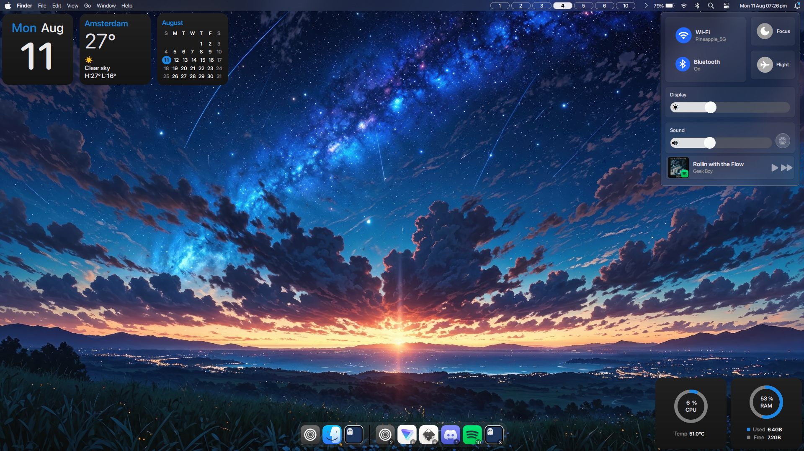

<p align="center">
  
</p>

<p align="center">
  <sub><sup></sup></sub>
  <a href="https://github.com/hyprwm/Hyprland">
    
  </a>
  <a href="https://github.com/Fabric-Development/fabric/">
    
  <sub><sup></sup></sub>
  </a>
  </p>

<div align="center">

[](https://github.com/S4NKALP/Modus/stargazers)
[](https://hyprland.org/)
[]()
[](https://discord.gg/EMWUTgegDm)

</div>

<br>

<figure>
  <h2>Home Screen:</h2>
  
  <br/>  
  <h2>Lock Screen:</h2>
    
</figure>
<br>

## Installation (WIP)

```bash
paru -S glace-git gtk-session-lock
git clone https://github.com/S4NKALP/Modus
cd Modus
python -m venv .venv
source .venv/bin/activate
pip install -r requirements.txt
pip install --no-deps git+https://github.com/Fabric-Development/fabric.git
```

<h2><sub></sub> Todo</h2>

- [x] Launcher
- [x] Dock
- [x] Notification
- [x] Control Center
- [x] Music Player
- [x] Desktop Widgets
- [x] New Launcher (maybe like Spotlight)
- [ ] Settings
- [ ] Magnifier hover effect on Dock
- [x] ~~New Application Switcher~~
- [x] Panel Widget
- [x] Calendar Widget
- [x] Expandable Notifiaction Centre
## Bug Fixes (the bug found till now)

- [x] WiFi
- [x] wifi off button looks bigger
- [x] Metadata Changes delay in Media Player

## Team

- [SANKALP](https://github.com/S4NKALP/)
- [tr1x_em](https://github.com/tr1xem)

## Special Thanks

A big thank you to the following people for their incredible help with code and creative ideas. Your help made a real difference!

- [darsh](https://github.com/its-darsh): for creating Fabric, which made everything possible.
- [gummy bear album](https://github.com/muhchaudhary): for sharing fantastic code snippets that saved me time and effort.
- [axenide](https://github.com/Axenide): for the amazing config that not only inspired parts of mine but also provided some gems I couldn’t resist borrowing.
- [E3nviction](https://github.com/E3nviction/): for code snippets and ideas that were incredibly helpful.

I truly appreciate your support
